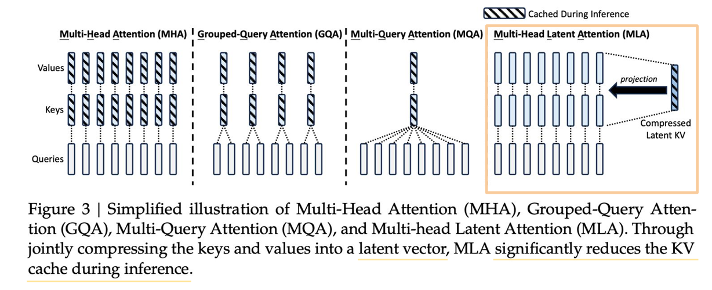

# MHA & GQA & MQA & MLA

## MHA
一个Q对应自己的K，V。若假设模型层数为$l$，头数为$n_h$，hidden_size为$d_h$，则普通MHA做法的单个token的KVCache大小为
\[
    2 \cdot l \cdot n_h \cdot d_h
\]

## GQA & MQA
多个Q共用一套K，V。
则MQA的KVCache大小为$2\cdot l \cdot d_h$。
设GQA把KV分成了$g$组，则GQA的KVCache大小为$2\cdot l \cdot g \cdot d_h$

## MLA
[DeepSeek-V3 Technical Report](https://arxiv.org/abs/2412.19437)
[deepseek技术解读(1)-彻底理解MLA（Multi-Head Latent Attention）​](https://zhuanlan.zhihu.com/p/16730036197)

存储activation在低秩降维后的结果，大大减少KVCache的大小。但在后续Attention计算中需要在每轮decode中重算KV，即把存储的压缩隐向量取出并做低秩升维。所以是一种“以空间换时间”的做法。