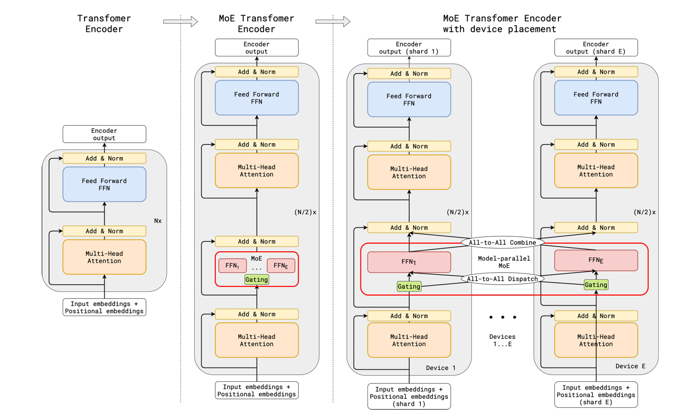

## MoE

MoE成立前提：transformer的FFN层具有稀疏性，一次前向仅激活少量参数。

MoE的应用使得LLM能在scale up参数量的同时维持较少的计算成本。

GShard: Scaling Giant Models with Conditional Computation and Automatic Sharding



## DP Attention

https://docs.sglang.ai/basic_usage/deepseek.html

在SGLang的DeepSeek实现中，Attention部分采用了DP而不是TP。这是针对DeepSeek特殊的MLA架构的设计。


## FusedMoe

[FusedMOE | gabrielolympie/moe-pruner | DeepWiki](https://deepwiki.com/gabrielolympie/moe-pruner/4.1-fusedmoe)

在目前SGLang的实现中，只做TP，每个rank都有所有专家一部分权重。

### Gating

activation会先通过gating层。gating为一小层神经网络，形状为`(hidden_size, expert_num)`，activation通过gating后，形状为

```
(seq_len, hidden_size) * (hidden_size, expert_num) = (seq_len, expert_num)
```

这时取topk，则选出了每个input token将要通过的各个expert的编号，即token_ids，形状为`(seq_len, topk)`。使通过gating后的activation留下topk的部分，再通过softmax，即得到各个专家对应的分数，将来用于加权各个专家的输出，形状也是`(seq_len, topk)`。

### All Gather & Reorder

在MoE的经典定义中，知道了input tokens将要去往哪些experts之后就需要执行dispatch操作，把这些tokens送往它对应的topk个expert所在的rank，并且在通过expert层之后需要将tokens送回原来的rank。

但在FusedMoE中，由于MoE层仅做了TP，因此事实上每个tp rank都应有完整的batch信息。所以在经过FusedMoE层之前需要进行一次All Gather。

在前面的attention层采用DP Attention的时候（即DeepSeek的情况），All Gather将各个dp rank的batch收集起来形成一个大batch，也就是所有的batch都经过了每一个rank上的FusedMoE层。

所以FusedMoE在获得topk_ids之后进行的不是dispatch操作，而是All Gather + Reorder。获得大batch之后，FusedMoE根据前面Gating算出来的token_ids进行Reorder操作，便于后面执行GroupGEMM。

由于GEMM为了保证效率，需要向量的内存位置连续，因此Reorder的目的就是：将去往相同expert的token放在一起。Reorder过后，activation的排布类似：
```
[expert_0_token_0, expert_0_token_1, ..., expert_1_token_0, expert_1_token_1, ..., expert_N_token_0, expert_N_token_1, ...]
```

### Group GEMM
见 [GroupGEMM](../../pytorch%20&%20cuda/GroupGEMM.md)

### Post reorder
这是再做Reorder的逆变换，保证后续过程的正确性。