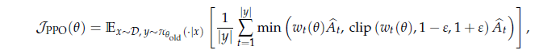
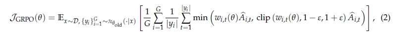
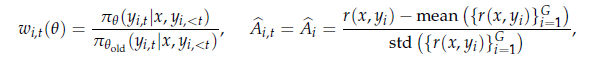
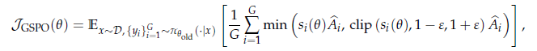
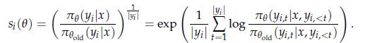

## PPO & GRPO & GSPO

[DeepSeek-R1: Incentivizing Reasoning Capability in LLMs via Reinforcement Learning](https://arxiv.org/abs/2501.12948)

[Group Sequence Policy Optimization](https://arxiv.org/pdf/2507.18071)

GRPO在PPO的基础上，减少了调用value model来评估每个response的advantage的复杂性，直接使用组内所有response的reward来计算advantage，即

这使得RL的一个step的计算过程大幅加速。

在GSPO的工作中，作者指出GRPO应用token粒度的importance weight来计算loss，会使得长文本训练场景下噪音被不断放大，导致不可逆的model collapse。这个现象在MoE场景下会更加显著，因为少量的模型权重更新之后，同一个prompt激活的专家可能会和原来的有很大不同。另外，reward的粒度一般是整个sequence，如sequence整体是否给出了正确答案，这与importance weight的粒度不匹配。

据此，GSPO指出优化目标的粒度应该跟reward的粒度对齐，即采用sequence粒度的importance weight：

通过对比GRPO和GSPO的梯度公式，可以得出token粒度的importance weight会导致每个token的log probability的梯度在整体loss中的贡献的不确定性很大，而GSPO则是将各个token的log probability的梯度作算数平均，这在一定程度上消除了GRPO的长文本不稳定性。

GSPO-token使得advantage可以和token的位置相关，从而获得更flexible的优化过程。

GSPO还使得RL训练框架的设计更加简便。由于训练和推理框架的精度不统一，且原来的GRPO使用token粒度的log probability，一般需要训练框架根据rollout的结果重算生成的token的log probability来避免精度问题。而在GSPO的情况下则有希望可以直接采用推理框架的sequence粒度的log probability。