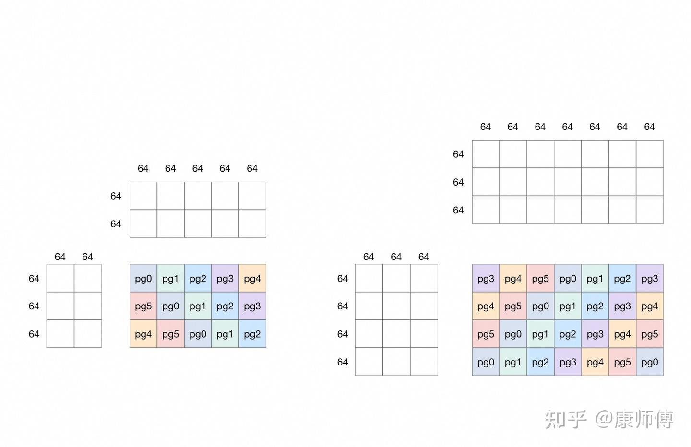

# GroupGEMM

[Group GEMM — Triton documentation](https://triton-lang.org/main/getting-started/tutorials/08-grouped-gemm.html)

[triton op - group gemm - 知乎](https://zhuanlan.zhihu.com/p/1900872094985716006)

公式：
$$
C^g_{[M\times N]} = A^g_{[M\times K]} \cdot  B^g_{[K\times N]}, \quad g=1,2,\dots, G
$$


```py
@triton.jit
def grouped_matmul_kernel(
    # device tensor of matrices pointers
    group_a_ptrs,
    group_b_ptrs,
    group_c_ptrs,
    # device tensor of gemm sizes. its shape is [group_size, 3]
    # dim 0 is group_size, dim 1 is the values of <M, N, K> of each gemm
    group_gemm_sizes,
    # device tensor of leading dimension sizes. its shape is [group_size, 3]
    # dim 0 is group_size, dim 1 is the values of <lda, ldb, ldc> of each gemm
    # a, b, c矩阵的某行/列首地址到下一行/列的步长
    g_lds,
    # number of gemms
    group_size,
    # number of virtual SM
    NUM_SM: tl.constexpr,
    # tile sizes
    BLOCK_SIZE_M: tl.constexpr,
    BLOCK_SIZE_N: tl.constexpr,
    BLOCK_SIZE_K: tl.constexpr,
):
    # 并行的标识符
    tile_idx = tl.program_id(0)
    last_problem_end = 0
    for g in range(group_size):
        # get the gemm size of the current problem
        gm = tl.load(group_gemm_sizes + g * 3)
        gn = tl.load(group_gemm_sizes + g * 3 + 1)
        gk = tl.load(group_gemm_sizes + g * 3 + 2)
        num_m_tiles = tl.cdiv(gm, BLOCK_SIZE_M)
        num_n_tiles = tl.cdiv(gn, BLOCK_SIZE_N)
        # 当前这次GEMM要算出多少个tile
        num_tiles = num_m_tiles * num_n_tiles
        # iterate through the tiles in the current gemm problem
        # 在当前GEMM problem中遍历，粒度为tile
        while (tile_idx >= last_problem_end and tile_idx < last_problem_end + num_tiles):
            # pick up a tile from the current gemm problem
            k = gk
            lda = tl.load(g_lds + g * 3)
            ldb = tl.load(g_lds + g * 3 + 1)
            ldc = tl.load(g_lds + g * 3 + 2)
            a_ptr = tl.load(group_a_ptrs + g).to(tl.pointer_type(tl.float16))
            b_ptr = tl.load(group_b_ptrs + g).to(tl.pointer_type(tl.float16))
            c_ptr = tl.load(group_c_ptrs + g).to(tl.pointer_type(tl.float16))
            # figure out tile coordinates
            tile_idx_in_gemm = tile_idx - last_problem_end
            # 当前tile在当前GEMM problem中的行、列坐标
            tile_m_idx = tile_idx_in_gemm // num_n_tiles
            tile_n_idx = tile_idx_in_gemm % num_n_tiles

            # do regular gemm here
            # 
            offs_am = tile_m_idx * BLOCK_SIZE_M + tl.arange(0, BLOCK_SIZE_M)
            offs_bn = tile_n_idx * BLOCK_SIZE_N + tl.arange(0, BLOCK_SIZE_N)
            offs_k = tl.arange(0, BLOCK_SIZE_K)
            # 当前tile内所有元素在当前GEMM problem中的地址，形状为(BLOCK_SIZE_M, BLOCK_SIZE_K)和(BLOCK_SIZE_M, BLOCK_SIZE_N)
            a_ptrs = a_ptr + offs_am[:, None] * lda + offs_k[None, :]
            b_ptrs = b_ptr + offs_k[:, None] * ldb + offs_bn[None, :]
            # 一个tile的缓存
            accumulator = tl.zeros((BLOCK_SIZE_M, BLOCK_SIZE_N), dtype=tl.float32)
            for kk in range(0, tl.cdiv(k, BLOCK_SIZE_K)):
                # 加载a的一行和b的一列中的各个tile，执行dot
                # hint to Triton compiler to do proper loop pipelining
                tl.multiple_of(a_ptrs, [16, 16])
                tl.multiple_of(b_ptrs, [16, 16])
                # assume full tile for now
                a = tl.load(a_ptrs)
                b = tl.load(b_ptrs)
                accumulator += tl.dot(a, b)
                a_ptrs += BLOCK_SIZE_K
                b_ptrs += BLOCK_SIZE_K * ldb
            c = accumulator.to(tl.float16)

            offs_cm = tile_m_idx * BLOCK_SIZE_M + tl.arange(0, BLOCK_SIZE_M)
            offs_cn = tile_n_idx * BLOCK_SIZE_N + tl.arange(0, BLOCK_SIZE_N)
            c_ptrs = c_ptr + ldc * offs_cm[:, None] + offs_cn[None, :]

            # assumes full tile for now
            tl.store(c_ptrs, c)

            # go to the next tile by advancing NUM_SM
            tile_idx += NUM_SM

        # get ready to go to the next gemm problem
        last_problem_end = last_problem_end + num_tiles

```
例子：

gemm0: [192, 128] * [128, 320]

gemm1: [256, 192] * [192, 448]

BLOCK_SIZE_M: 64,

BLOCK_SIZE_N: 64,

BLOCK_SIZE_K: 64,

NUM_SM: 6 (grid)

